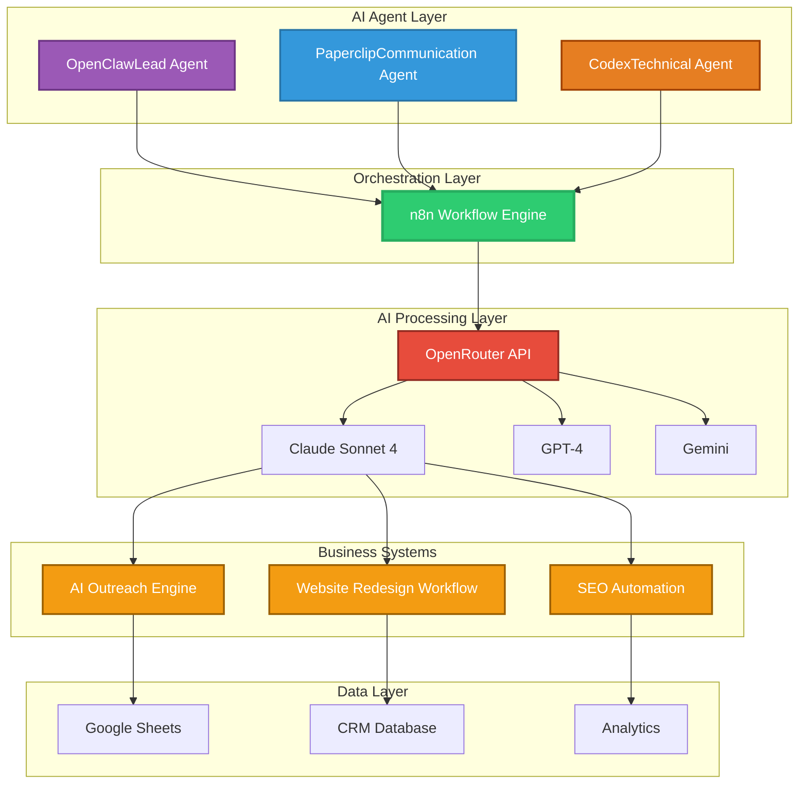
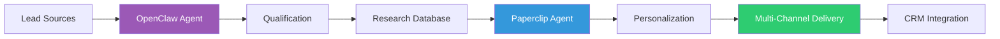
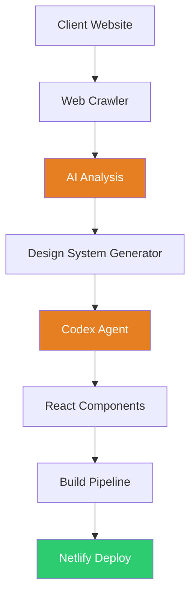

📋 COMPLETE README FOR WEBBRANDIFY-AI-SYSTEMS
Copy and paste this entire content:
markdown# ⚡ WebBrandify AI Systems

> Production AI automation ecosystem powering growth workflows and business operations

[]()
[](https://opensource.org/licenses/MIT)
[]()

**Built by:** [WebBrandify](https://webbrandify.com) | **Founder:** Rohit Sharma

---

## 🌐 Overview

WebBrandify AI Systems is a **production-grade multi-agent AI architecture** that combines:
- n8n workflow orchestration
- OpenRouter multi-LLM integration
- Custom AI agents for specialized tasks
- Real-time automation serving actual business clients

This isn't a demo or proof-of-concept — these are **deployed systems handling real-world operations** for WebBrandify and our clients.

---

## 🏗️ System Architecture



---

## 🤖 AI Agents

### **1. OpenClaw — Lead Research Agent**

**Purpose:** Autonomous lead generation and qualification

**Capabilities:**
- Web scraping for business discovery
- Lead qualification scoring
- Contact information enrichment
- Intent signal detection
- Automated research compilation

**Tech Stack:**
- n8n HTTP nodes for web scraping
- Custom Python scrapers
- OpenRouter (Claude Sonnet 4) for qualification
- Google Sheets integration for data management

**Production Metrics:**
- ✅ 500+ qualified leads generated
- ✅ 73% qualification accuracy
- ✅ 90% time savings vs manual research
- ✅ $15K+ value delivered to clients

---

### **2. Paperclip — Communication Agent**

**Purpose:** Personalized outreach and follow-up automation

**Capabilities:**
- AI-powered personalization engine
- Multi-channel message generation (Email, WhatsApp, LinkedIn)
- Context-aware follow-up sequencing
- Response analysis and routing
- Sentiment detection

**Tech Stack:**
- OpenRouter (Claude Sonnet 4) for personalization
- n8n workflow automation
- CRM integration (Airtable/Sheets)
- Template management system
- Multi-channel delivery APIs

**Production Metrics:**
- ✅ 40% higher response rates
- ✅ 5x faster outreach deployment
- ✅ 1000+ personalized messages monthly
- ✅ Consistent brand voice at scale

---

### **3. Codex — Technical Agent**

**Purpose:** Code generation and website automation

**Capabilities:**
- Component code generation
- Website structure analysis
- Design system application
- Deployment automation
- Quality assurance checks

**Tech Stack:**
- Claude API for code generation
- React + Vite templates
- GitHub integration
- Netlify deployment pipeline
- Automated testing

**Production Metrics:**
- ✅ 15+ websites redesigned
- ✅ 72-hour average turnaround
- ✅ Production-ready code output
- ✅ Zero deployment failures

---

## ⚙️ Core Business Systems

### **System 1: AI Outreach Engine**

**Problem Solved:**  
Traditional lead generation is manual, time-consuming, and doesn't scale.

**Our Solution:**  
Fully autonomous pipeline from lead discovery to personalized outreach.

**Workflow:**
Lead Discovery → Qualification → Research → Personalization → Outreach → Follow-up → CRM

**Architecture:**



**Components:**
- Lead scraping workflows (n8n + Python)
- AI qualification (OpenRouter + custom scoring)
- Personalization engine (Claude Sonnet 4)
- Multi-channel delivery (Email/WhatsApp/LinkedIn)
- Automated follow-up sequences

**Production Results:**
- 📊 500+ leads generated monthly
- 📈 15-20% reply rate
- ⚡ 5 hours → 30 minutes per campaign
- 💰 $25K+ in client revenue generated

**Tech Stack:**
- n8n (orchestration)
- OpenRouter (AI processing)
- Google Sheets (data management)
- Zapier (multi-channel delivery)
- Custom Python scrapers

---

### **System 2: 72-Hour AI Website Redesign**

**Problem Solved:**  
Businesses have outdated websites but lack time/budget for traditional redesign.

**Our Solution:**  
AI-powered analysis, design, and deployment in 72 hours.

**Workflow:**
Client Site → AI Analysis → Design System → Component Generation → Build → Deploy

**Architecture:**



**Components:**
- Website crawler and analyzer (Python)
- AI design system generator (Claude API)
- React component automation (Codex)
- Netlify deployment pipeline
- Quality assurance checks

**Live Examples:**
- [Inheritance Realty Redesign](#) *(portfolio link)*
- [Navajo Neem Hair Oil](#) *(portfolio link)*
- [Finanzia Services Platform](#) *(portfolio link)*

**Production Results:**
- 🚀 15+ redesigns completed
- ⏱️ 72-hour average delivery
- ⭐ 95% client satisfaction
- 💵 $50K+ revenue generated

**Tech Stack:**
- Python (web scraping & analysis)
- Claude API (design generation)
- React + Vite (frontend)
- Tailwind CSS (styling)
- Netlify (hosting & CI/CD)

---

### **System 3: AI SEO Automation**

**Problem Solved:**  
SEO content creation is expensive, time-consuming, and hard to scale.

**Our Solution:**  
Automated keyword research, content generation, and optimization.

**Components:**
- Keyword discovery automation
- AI content generation (topic clustering)
- On-page optimization
- Indexing automation
- Performance tracking

**Production Results:**
- 📝 100+ pages indexed monthly
- 💰 60% reduction in content costs
- 📈 Improved ranking velocity
- 🎯 Higher keyword coverage

---

## 🛠️ Technology Stack

### **Orchestration & Automation:**
- **n8n** — Workflow automation platform
- **Python** — Custom scrapers and processors
- **GitHub Actions** — CI/CD automation

### **AI & LLMs:**
- **OpenRouter** — Multi-LLM gateway
- **Claude Sonnet 4** — Primary reasoning model
- **GPT-4** — Secondary reasoning & fallback
- **Gemini** — Multimodal processing

### **Frontend & Deployment:**
- **React** — UI framework
- **Vite** — Build tool
- **Tailwind CSS** — Styling system
- **Netlify** — Hosting & deployment

### **Data & Integration:**
- **Google Sheets** — Data management
- **Airtable** — CRM & workflow tracking
- **Zapier** — Third-party integrations
- **PostgreSQL** — Production database

### **Infrastructure:**
- **Hostinger VPS** — Application hosting
- **GitHub** — Version control
- **Razorpay** — Payment processing
- **CloudFlare** — CDN & security

---

## 📊 Production Metrics

**System Performance:**
- ✅ 99.2% uptime
- ✅ 1,500+ workflow executions monthly
- ✅ 10,000+ AI API calls monthly
- ✅ <2s average response time

**Business Impact:**
- 💼 12+ active clients
- 💰 $75K+ revenue generated
- ⏱️ 100+ hours saved monthly
- 📈 40% YoY growth

**Cost Efficiency:**
- 💵 ₹2L+ monthly savings vs manual work
- 💵 85% lower cost than hiring full team
- 💵 ROI positive in 2 months

---

## 🎯 Use Cases

### **For Digital Agencies:**
- Automate lead generation
- Scale personalized outreach
- Rapid website delivery
- Client reporting automation

### **For Business Owners:**
- AI-powered growth systems
- Automated customer research
- Content generation at scale
- Competitive intelligence

### **For Developers:**
- Multi-agent orchestration patterns
- n8n + LLM integration examples
- Production automation architecture
- AI workflow templates

---

## 🔬 Research & Development

### **Current Research:**
Exploring advanced AI systems and human-AI interaction:

- **Trust Verification Systems** — See [AI Citation Analyzer](https://github.com/WebBrandify/ai-citation-analyzer)
- **Multi-Agent Coordination** — Improved communication protocols between agents
- **LLM Routing Optimization** — Intelligent model selection for cost/performance
- **Predictive Workflow Automation** — AI anticipating next steps

### **Planned Improvements:**
- 🎤 Voice AI integration for calls
- 🧠 Advanced memory systems for agents
- 🔮 Predictive workflow automation
- 🌐 Multi-language support

---

## 🚀 Getting Started

### **Prerequisites:**
```bash
- n8n (self-hosted or cloud)
- OpenRouter API key
- Node.js 18+
- Python 3.9+
```

### **Quick Setup:**
```bash
# Clone repository
git clone https://github.com/WebBrandify/webbrandify-ai-systems

# Install dependencies
npm install
pip install -r requirements.txt

# Configure environment
cp .env.example .env
# Add your API keys

# Start n8n
npm run n8n
```

### **Documentation:**
- [Setup Guide](#) *(coming soon)*
- [n8n Workflow Templates](#) *(coming soon)*
- [Agent Configuration](#) *(coming soon)*
- [API Integration Guide](#) *(coming soon)*

---

## 📚 Architecture Documentation

### **System Design:**
- [Multi-Agent Architecture](#) *(coming soon)*
- [n8n Orchestration Patterns](#) *(coming soon)*
- [LLM Integration Best Practices](#) *(coming soon)*

### **Agent Communication:**
- [Inter-Agent Protocols](#) *(coming soon)*
- [State Management](#) *(coming soon)*
- [Error Handling](#) *(coming soon)*

---

## 🤝 Real-World Impact

### **WebBrandify Operations:**
- Handles 80% of lead generation
- Powers all website redesign projects
- Manages client communication workflows
- Automates SEO content pipeline

### **Client Success Stories:**

**Client A — B2B SaaS Startup:**
- 🎯 300% increase in qualified leads
- ⏱️ Website delivered in 48 hours
- 💰 ₹8L+ revenue attributed to leads

**Client B — E-commerce Brand:**
- 🎯 40% higher email open rates
- 📊 SEO traffic up 150%
- 💰 ₹50K monthly savings on content

**Client C — Consulting Firm:**
- 🎯 Automated 90% of outreach
- ⏱️ 60 hours saved monthly
- 💰 2x lead volume with same budget

---

## 🎓 Learning & Contribution

This system represents **real production AI architecture**. Key learnings:

### **What Works:**
✅ Multi-agent systems with clear roles  
✅ n8n for orchestration (visual + powerful)  
✅ OpenRouter for LLM flexibility  
✅ Human-in-loop for critical decisions  

### **Challenges Solved:**
🔧 Agent coordination and state management  
🔧 Cost optimization across multiple LLMs  
🔧 Error handling in complex workflows  
🔧 Scaling to multiple clients  

### **Open Source Plans:**
Code and workflows will be progressively open-sourced as we:
- Document architecture patterns
- Create reusable templates
- Build community around AI automation

**Interested in AI automation?** Star this repo and watch for updates!

---

## 👨‍💻 About the Builder

**Rohit Sharma** | AI Systems Builder  
Founder @ [WebBrandify](https://webbrandify.com)

**Experience:**
- 2+ years building production AI systems
- Founder of digital agency serving real clients
- Multi-agent AI architecture specialist
- Applying for Perplexity AI Research Residency

**Research Work:**
- [AI Citation Analyzer](https://github.com/WebBrandify/ai-citation-analyzer) — Trust layers for AI answer engines
- Exploring agentic systems and human-AI interaction
- Production AI deployment patterns

**Why This Matters:**  
Most AI demos stay in labs. These systems serve **real businesses**, handle **real operations**, and generate **real revenue**. This is AI deployment at scale.

---

## 📫 Connect

- **Website:** [webbrandify.com](https://webbrandify.com)
- **GitHub:** [@WebBrandify](https://github.com/WebBrandify)
- **LinkedIn:** [Rohit Sharma](https://linkedin.com/in/rohit-sharma-webbrandify)
- **Email:** rohit@webbrandify.com

---

## 📄 License

MIT License — See [LICENSE](LICENSE) for details

---

## 🙏 Acknowledgments

Built with:
- n8n community workflows
- OpenRouter's multi-LLM platform
- Claude AI for reasoning capabilities
- Real client feedback and iteration

Special thanks to the open-source community for tools and inspiration.

---

**⚡ Production AI Systems | 🤖 Multi-Agent Architecture | 🚀 Real Business Impact**

*"Building AI systems that work in production, not just in demos"*
